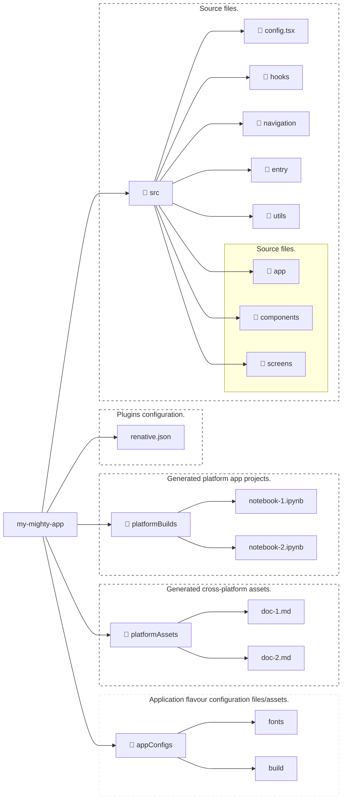

# Project Structure

📂 The folder structure for Mighty Apps Builder projects is expressed below:

An example project schema:

    ├── README.md             <- The project overview.
    ├── docs                  <- All project documents.
    │   ├── doc-1.md
    │   └── doc-2.md
    └── notebooks             <- All project notebooks.
        ├── notebook-1.ipynb
        └── notebook-2.ipynb

