# Project Structure

📂 The folder structure for Mighty Apps Builder projects is expressed below:

```mermaid
graph LR
    root[my-mighty-app] --> 1["📁 appConfigs"]

    root --> 2["📁 platformAssets"]
    root --> 3["📁 platformBuilds"]
    root --> 4["📁 src"]
    root --> root1


    subgraph 1g[Application flavour configuration files/assets.]
      1 --> 11[fonts]
      1 --> 12[build]
    end
    subgraph 2g[Generated cross-platform assets.]
      2 --> 21[doc-1.md]
      2 --> 22[doc-2.md]
    end
    subgraph 3g[Generated platform app projects.]
      3 --> 31[notebook-1.ipynb]
      3 --> 32[notebook-2.ipynb]
    end
    subgraph 4g[Source files.]
      subgraph 4gh[Source files.]
        43["📁 app"]
      end
       subgraph 4gh[Source files.]
        44["📁 components"]
      end

      subgraph 4gh[Source files.]
        45["📁 screens"]
      end
      4 --> 43
      4 --> 44
    4 --> 48["📁 entry"]

      4 --> 46["📁 hooks"]
      4 --> 47["📁 navigation"]
      4 --> 45
      4 --> 49["📁 utils"]
      4 --> 42["📄 config.tsx"]


    end
    subgraph 5g[Plugins configuration.]
        root1[renative.json]
    end

    click root "https://gitlab.com/joaommpalmeiro/diagram-scratchpad"
    click 1 "https://gitlab.com/joaommpalmeiro/diagram-scratchpad/blob/master/README.md"

linkStyle 0,1,2,3,4,5,6 stroke-width:1px;

style 1g fill:transparent,stroke:#E5E5E5,stroke-width:1px,stroke-dasharray:5;
style 2g fill:transparent,stroke:#323232,stroke-width:1px,stroke-dasharray:5;
style 3g fill:transparent,stroke:#323232,stroke-width:1px,stroke-dasharray:5;
style 4g fill:transparent,stroke:#323232,stroke-width:1px,stroke-dasharray:5;
style 5g fill:transparent,stroke:#323232,stroke-width:1px,stroke-dasharray:5;

```

An example project schema:

    ├── README.md             <- The project overview.
    ├── docs                  <- All project documents.
    │   ├── doc-1.md
    │   └── doc-2.md
    └── notebooks             <- All project notebooks.
        ├── notebook-1.ipynb
        └── notebook-2.ipynb

